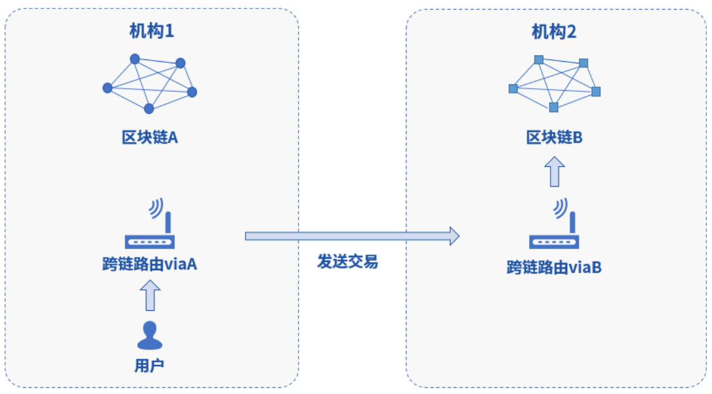
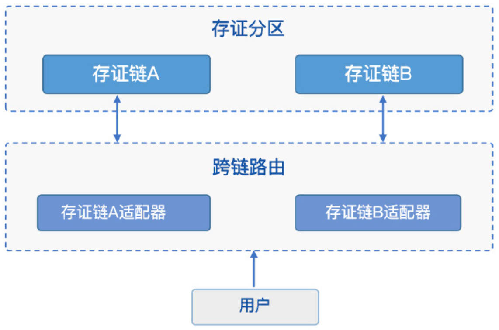

** 目录**

[toc]


#Xuperchain

超级链是一个易于编程的区块链框架，可以方便地定制新的功能。基于此框架，超级链设计了一个轻量级的跨链方案，通过合约和一些基础库组成了一个完整的跨链方案，适用于不同的跨链应用场景。


图 超级链跨链方案

超级链的跨链方案主要包括3层， 分别是基础库层、账本层和合约层。其中基础库层和账本层属于超级链的内核层，包括跨链域名解析协议、梅克尔proof校验、异构区块头解析协议、事务预锁定等。合约层是使用用户合约实现的合约基础库，主要是区块头管理合约、链名解析合约、去中心化身份管理等能力。

通过对用户实际需求的调研，超级链抽象出三种不同的跨链场景，分别是只读事务场景跨链、非事务场景跨链和事务场景跨链。并通过上述合约和基础库的能力设计了满足不同场景的解决方案。

##跨链域名解析

跨链涉及到不同链资源的互操作，由于不同的链的协议各不相同，为了实现对不同链的资源进行统一定义，超级链定义了如下跨链寻址协议，结合着链名解析合约，便可以实现对任何协议链的统一资源寻址。    

```
    [chain_scheme:][//chain_name][path][?query] 
```

·    chain_scheme：跨链链类型标识符，用于标识链的具体类型，比如： xuper 表示所跨链链接的链的类型是超级链。

·    chain_name：所跨链的链名，定位某一个具体的链，同一Scheme下链名是唯一的；

·    path：不同Scheme的链类型扩展字段；

·    query：用于定位某个链内的某项资源，比如对于超级链，声明调用的合约名、方法名和参数等信息；

##链名解析合约

为了实现跨链请求，仅有上面的链名跨链寻址协议是不够的，在跨链发起的原链上还需要部署一个链名解析合约，为用户提供解析的接口。

```
// 注册一个网络，同时包含网络初始meta信息
RegisterChain(name, chain_meta)
// 更新一个网络的meta信息，比如修改网络的背书策略
UpdateChain(name, chain_meta)
// 根据网络名解析所有背书节点
Resolve(chain_name) *CrossQueryMeta
// 插入一个背书节点
AddEndorsor(chain_name, info)
// 更新背书节点信息
UpdateEndorsor(chain_name, address, info)
// 删除背书节点
DeleteEndorsor(chain_name, address)
// 目标网络meta信息
message CrossChainMeta {
        string type = 1;
        int64 min_endorsor_num = 2;
}
// 目标网络背书信息
message CrossEndorsor {
        string address = 1;
        string pub_key = 2;
        tring host = 3;   // ip+port
}
// 目标网络CrossQuery完整信息
message CrossQueryMeta {
        CrossChainMeta chain_meta = 1;
        repeated CrossEndorsor endorsors = 2;
}
```

##只读事务场景跨链

在大部分使用场景下，用户仅希望从一个链能够查询到另一个链的数据，并且能够满足稳定性、幂等性和安全性，称为只读事务跨链。只读事务跨链的典型场景包括身份认证、资质认证等。

> 幂等性：用户对于同一操作发起的一次请求或者多次请求的结果是一致的，不会因为多次点击而产生了副作用 。

###基本架构

为了满足上述要求，百度超级链采取了目标链背书的方式，如下图所示：


完整的步骤如下：

1. 用户在原链发起预执行，合约内部调用”cross_query”原语，访问目标链Hello()合约；
2. 原链内部解析到”cross_query”原语后会调用跨链寻址合约解析目标链链接和背书信息；
3. 原链访问目标链的背书服务；
4. 目标链背书服务内部访问Hello()合约，得到Response并进行签名，返回给原链；
5. 原链继续执行合约，并返回预执行结果给用户；
6. 用户组装完整的交易提交给原链网络；

###二阶段处理

超级链的合约采用的是先预执行再提交的二阶段处理过程。

> 二阶段处理过程：预执行每个合约时为其提供只读的智能缓存，为合约的预执行生成读写集和结果；验证合约时，验证节点根据事务初始化缓存，将再次执行合约，但是此时合约只能从读写集读取数据，写入数据也会在写入集中生效。当验证节点生成的写集和事务携带的写集一致时合约验证通过。

**预执行阶段**，原链节点会远程访问目标链背书服务，背书服务会预执行该合约并且对合约结果进行签名背书，原链会将该合约的结果和背书信息写进写集中一个特殊的bucket中。

**提交阶段**，不需要再进行远程调用，原链节点在验证合约时，首先会解析出该特殊的写集中的跨链结果和背书签名信息，以填充合约执行的上下文环境，当执行到只读跨链原语时，原链节点不再进行远程调用，而是验证预执行的背书签名，当签名满足背书策略的要求后，就直接使用写集中的跨链合约结果继续后续的合约逻辑，否则验证失败。

## 非事务场景跨链

非事务场景跨链是指跨链行为并不是要求不同链上的交易具备事务性，即不要求不同链上的跨链交易同时生效或同时失败，跨链交易只对当时被跨链的交易状态进行确认，并根据目标交易状态执行交易后续操作。

例如，在A链上发起的交易tx1执行成功后，发起B链上的交易tx2，但tx2执行失败并不会影响tx1，即不会发生tx1回滚。这种存在依赖的交易，但不保证多个交易执行满足事务性的场景。

非事务跨链的典型场景比如身份验证、预言机、资产跨链转移等等，在技术上主要强调跨链交易的存在性证明，但对跨链交易的原子性没有要求。

百度超级链实现了一套中继机制，通过对目标链的区块头同步，以及梅克尔验证技术，可以做到在原链上直接验证目标链的交易是否存在。

如下图是中继机制的整体结构，主要分为以下两个部分：

- **链上中继合约(XuperRelayer)**：部署在原链上的一个智能合约，会保存目标链的所有块头信息，并提供基于梅克尔证明的目标链交易存在性验证。
- **中继同步进程(Relay Process)**：在目标链和原链之间，会有一个或多个中继进程，持续监听目标链的最新出块信息，并抽取出块头信息写入


在B链上发起tx1交易，然后原链上发起tx2交易。tx2交易成功的前提条件是确认tx1交易已经生效。因此整个跨链交易生效流程：

1. 用户首先在目标链提交tx1交易；
2. 当tx1交易打包在块中后，中继同步进程会将块头同步到原链上，并保存在链上中继合约中；
3. 用户在原链上发起资产转移交易tx2，同时在合约参数中填写tx1的信息以及tx1的梅克尔路径；
4. 原链中的用户合约通过跨合约调用调用链上中继合约，进行梅克尔验证，如果证明tx1确实存在在目标链中，则返回验证成功，否则返回验证失败；
5. 用户合约在拿到tx1验证成功的结果后，执行后续资产转移操作，并返回结果。

### 梅克尔证明

在超级链中，区块头保存了块中所有交易的txid构造出的梅克尔树的树根。交易的验证方只需要知道待验证交易tx1的txid，tx1所在块的block1，并知道从tx1所在梅克尔树的叶子节点开始到梅克尔树根的路径上所有兄弟节点的hash值，就可以计算出梅克尔树根。


例如我们要验证梅克尔树中绿色节点9Dog的存在性，那么我们同时给出从9Dog到梅克尔树根的路径上的所有兄弟节点数组[1FXq, ec20, 8f74]，则从下而上:

```
Hash(1FXq+9Dog) ⇒ 781a
Hash(ec20+781a) ⇒ 5c71
Hash(5c71+8f74) ⇒ 6c0a
```

在得到计算出的根Hash后，我们从链上中继合约中获取之前已经保存的block1对应的区块头中的梅克尔树根，如果也是6c0a则证明验证通过，否则验证不通过。

### 链上中继合约

链上中继合约是跨链存在性证明的核心，提供对目标链中的区块头同步存储，并通过梅克尔验证技术提供交易查询接口。链上中继合约主要解决三个问题，交易的真实性、及时性证明、区块头分叉管理。

- **真实性证明**：即证明交易确实存在，主要通过Merkle Proof证明交易是否真的存在于链中以及是否在主干上。
- **及时性证明**：即证明交易是否确认，跟目标链采用的共识算法相关。对于同步Byzantine类共识算法，及时性是内置的，只要交易在区块头中，那么交易必定在原链处于上链状态。对于PoW类共识算法，一般要求交易所在块距主干最新高度相差6个块以上。
- **区块头分叉管理**：对同步的区块头按照树形结构维护依赖关系，并根据目标链的主干选择算法即使调整目标链的主干区块状态。

```
initAnchorBlockHeader(blockHeader): 初始化锚点区块头，锚点区块头一般是初始化后写入的第一个区块头，目 标链不一定需要从创世块开始同步，因此有了锚点区块的概念。

putBlockHeader(blockHeader): 写入一个新区块头信息，会自动验证区块头数据是否正确并进行分叉管理

verifyTx(blockid,txid,proofPath,hash,txIndex):交易验证接口，通过梅克尔证明验证他链上的交易id是否真实有效

```

### 中继同步进程

中继同步进程相对简单，主要通过对目标链的出块监听，将最新区块中的区块头信息抽取出来，并同步到原链中。

## 方案总结

百度超级链借助链内寻址合约以及链间中继合约实现多场景的跨链互操作。链内寻址合约引导用户根据跨链资源协议给定目标链的信息，随后链内寻址合约调用跨链资源解析合约解析目标链的信息，再通过封装的账本层实行**两阶段处理（先预执行目的区块链的读写集，然后在本地区块链执行交易，观察产生的读写集与目的区块链读写集是否匹配，如果匹配则有效，反之无效）**实现只读场景的跨链；非事务场景则需要借助链间中继合约获取目标链的**默克尔根（验证交易是否存在）**等数据进行两阶段验证，维护跨链交易的存在性。

该方案目前只对超级链开放网络中的区块链有效，对其他区块链网络的支持还在陆续开发中。

# WeCross

WeCross 着眼应对区块链行业现存挑战，不局限于满足同构区块链平行扩展后的可信数据交换需求，还进一步探索异构区块链之间因底层架构、数据结构、接口协议、安全机制等多维异构性导致无法互联互通问题的有效解决方案。

针对不同服务形态、不同区块链平台之间无法进行可信连接与交互的行业痛点，为解决底层架构不同，互通难、数据结构不同，互认难、接口协议不同，互联难、安全机制不同，互信难、业务模式不同，互访难等问题，研发区块链跨链协作平台——WeCross，以促进跨行业、机构和地域的跨区块链信任传递和商业合作。

##基本组成

WeCross 对区块链的多层次抽象，在多个关键维度上追求跨链操作的高安全性、高扩展性和高易用性，如下图所示。


该架构包括以下部分：

- 跨链路由(WeCross Router)
   – 与链对接，对链上的资源进行抽象 

   – 向外暴露统一的接口
   – 将调用请求路由至对应的区块链

- 控制台(WeCross Console) 

  – 命令行式的交互

  – 查询跨链信息，发送调用请求

- 跨链 SDK(WeCross Java SDK)

  – WeCross开发工具包，供开发者调用WeCross 

  – 集成于各种跨链APP中，提供统一的调用接口 

  – 与跨链路由建立连接，调用跨链路由

- 跨链资源(Resource)
   – 各种区块链上内容的抽象
   – 包括:合约、资产、信道、数据表

- 跨链适配器(Stub)
   – 跨链路由中对接入的区块链的抽象
   – 跨链路由通过配置Stub与相应的区块链对接
   – FISCO BCOS需配置FISCO BCOS Stub、Fabric需配置Fabric Stub

- IPath(Interchain Path)
   – 跨链资源的唯一标识
   – 跨链路由根据IPath将请求路由至相应区块链上 

-  跨链分区
   – 多条链通过跨链路由相连，形成跨链分区
   – 跨链分区有唯一标识，即IPath中的第一项

## 体系抽象

为打通异构区块链之间的交互，首先为这些异构区块链设计统一的“语言”，即统一的 体系结构抽象。基于统一的体系结构，异构区块链之间找到双方都能理解的“语言”，互联互通才有可能实现。基于跨链所需的关键要求，WeCross 在核心数据结构、区块链交互模式 和事务管理上提取业界主流区块链产品核心且必需的公共子集，对区块链平台进行多层抽象，如下图所示。


**数据层:**跨链交互的核心是数据在链间的流动，数据层的抽象就尤为重要。跨链涉及的数据维度包括区块、交易、合约、消息等多个方面。WeCross 以满足跨链基本要求为前提，提炼通用区块数据结构，将交易、合约和消息等抽象设计成资源类型，为资源设计通用的寻址协议。

**交互层:**不同业务场景有不同的跨链交互模型，基于抽象数据层，WeCross 建设通用区块链适配与路由中继网络，结合标准默克尔证明机制，实现跨链交互层抽象设计。

**事务层:**基于数据结构和交互的抽象层，实现跨链事务效果。目前支持两类机制:两阶段事务和哈希时间锁定事务。未来将依据场景需求设计更多事务机制。

抽象区块里包含业界主流区块链共同的数据字段，用于验证区 块链结构的正确性、查询区块链当前状态和验证区块链数据等。多个区块链之间，通过相互 同步和获取抽象链的方式，来确认其它区块链的状态，验证预期交互数据的正确性。以 FISCO BCOS 和 Hyperledger Fabric 为例，二者的区块结构中，区块高度、区块哈希、 上一块哈希和状态数据哈希值字段的含义是相同的，不同的是用于验证的默克尔根字段。

抽象区块的数据字段可以分为两类，一类是区块信息字段，包括区块高度、区块哈希值 和上一块哈希，这些字段用于验证区块链的正确性;另一类是信息验证字段，包括交易默克 尔根、回执默克尔根和状态默克尔根，分别用于验证该区块相关的交易、回执和状态数据的 存在性和正确性，以证明某个交易是否属于当前区块、某个回执是否属于当前区块等。

WeCross 抽象体系结构中的任一层都是通用可替换的，无论底层技术实现如何替换，上层的逻辑都可以通用。开发者只需要根据业务逻辑调用相应的层次，即可实现对区块链跨链的操作，无需关注跨链底层实现。

## 基本架构

WeCross 的跨链系统架构设计充分考虑跨行业、机构和地域的多区块链互联，无论是新部署的区块链平台还是已有的区块链平台，都可以基于区块链体系抽象，在不改动原有区块链平台底层的前提下，无缝接入WeCross平台。


**跨链分区(Zone):**指运行着同一类业务的区块链集合。WeCross 可以对这个区块链集合本身和内部的区块链资源进行命名和寻址。例如，图中存证业务的命名空间为“存证分区”，结算业务的命名空间为“结算分区”。存证分区里有两条存证链分别是存证链 A 和存 证链 B，存证链 A 链上部署一个资产存证资源，产生的费用和相关的资产可能需要存证。于是，根据业务需要，跨链操作会产生分区和分区之间，以及分区内部的链和链之间。

**跨链路由(Router):**指用于桥接业务系统与区块链的服务进程。多个跨链路由之间可以相互连接，相互转发请求。用户通过向跨链路由发起请求来访问跨链分区中的资源。

**跨链适配器(Stub):**指连接一个区块链的接口实现，可由跨链路由加载。跨链路由可 以配置多个区块链适配器，达到连接多条区块链的效果。跨链路由间会自动同步区块链适配器的配置信息，从而帮助用户寻址位于其他区块链上的资源。

**跨链资源(Resource):**指区块链上的智能合约、数字资产等用户可访问的数据对象。 类似于区块链适配器的配置信息，跨链资源的元信息也在跨链路由之间同步。用户通过统一 的接口对跨链分区中的资源进行寻址和调用。

跨链分区、业务链和区块链资源都有唯一的标识，通过组合三种标识，可以唯一地定 位到跨链系统中的任一资源的位置，这个寻址的标识称为跨链路径(iPath，Interchain Path)，跨链路径定义为:**`[ 跨链分区 ].[ 业务链 ].[ 区块链资源 ]`**，则访问存证链A的资产资源，跨链路径为:存证分区 . 存证链A . 资产资源。

WeCross 设计实现 HTTP Restful 接口访问跨链路径，支持以 HTTP URL 的形式访问跨 链系统中的资源，URL 格式为:**`http://IP:Port/**[ 跨链分区 ]/[ 业务链 ]/[ 区块链资源 ]**/[ 资源方法 ]`**。

## 可信交互

区块链平台设计的基本安全假设是“每个参与者皆有可能作恶”，在此假设下通过密码 学与共识算法等机制构建分布式可信环境。然而此可信环境往往只在区块链平台内部生效，无法简单被另一个区块链平台信任，需要引入额外的可信证明信息来实现跨区块链平台的可信交互。WeCross 在处理跨链交互时除了传输区块链交易信息外，还会额外传输区块链交易的相关证明数据，并使用这些信息进行交易和回执(交易执行结果)的存在性证明，以证明链上信息的真实与可靠。



以上图所示的跨链交互为例，机构 1 和机构 2 分别部署了区块链 A 和区块链 B，现在机构 1 的用户要访问机构 2 的区块链 B，并要求访问的结果真实可信，其跨链交互时序如下图所示。


与传统的区块链交易处理流程相比，WeCross 跨链路由除了传输交易和回执的信息，还 额外传输交易和回执的默克尔证明，交易的发送方使用这些证明来进行跨链数据访问的可信 验证，使交易的发送方能确认交易在目标区块链上真实发生且获得结果，保证交易和回执的 真实可信。

WeCross 遵循跨链交互数据皆可自证的原则，要求交互响应消息同时携带数据和证明， 该规则普遍适用于各类跨链场景，可用于保障整个交易流程的真实可信。

#### 单分区单路由

针对一个机构的用户需要同时访问多个区块链的场景，可以在机构内 搭建一个跨链路由，并为其配置多个区块链适配器，连接到多个区块链。通过给多个区 块链适配器配置不同的 iPath 前缀，用户可以通过跨链路由，任意寻址并访问网络中的 资源。如图所示，用户 A 可以通过配置了两个不同区块链适配器的跨链路由，实现对 两条链上资源的访问。



#### 单分区多路由

针对多个机构的多个用户想要交叉访问对方的区块链，可以部署多个 跨链路由，并为其配置各自的区块链适配器。**跨链路由之间通过 P2P 网络协议相连， 跨链路由之间会自动同步交换各自的区块链适配器和资源信息**。不同机构的用户可以通 过调用本机构的跨链路由，由本机构的跨链路由转发至其它机构的跨链路由，访问相应 资源并按路由返回。如图所示，用户甲可以通过跨链路由 viaA 和跨链路由 viaB 组成的 路由网络，实现对两条存证管理链上资源的访问。


#### 多分区多路由

在更为复杂的业务场景中存在多种业务相互融合的需求，因此也就存 在多个跨链分区互联访问的需求。面对这种需求，HIP 支持跨链路由动态增加与其他跨链路由的连接，通过权限控制保证跨链访问的安全可控，对原有业务不做任何渗透修改。如图所示，通过跨链路由将存证分区和结算分区相连，实现原有两个分区的用户能够访问对方分区的资源。


#### 跨链路由设计

跨链路由要在区块链之间建立连接，为了保证跨链路由间能维持高效、可靠和安全的网

**网络准入:**跨链路由支持基于CA 认证机制的网络准入，支持任意多级的证书结构，保障信息保密性、认证性、完整性、不可抵赖性。所有通讯链路使用SSL 加密，加密算法可配置，保证数据传输的安全性。

**TCP 长连接:**跨链路由之间维持长连接以保证双向通信，减少建立连接和断开连接的开销。跨链路由网络之间使用心跳包来保证可用性，在断连的时候自动重连。

**状态同步:**跨链路由之间会自动同步各自区块链的区块高度、共识和网络等状态。

**自适应路由:**跨链路由在P2P 网络中，会自动搜索和确认与另一个跨链路由的可行链 路，并评估链路的响应速度、带宽和可用率，自动选取最佳的链路，当一个链路失效 时，跨链路由会选取另一个可用的链路，保证跨链消息的可用性。

#### 跨链事务

##### 两阶段提交

两阶段提交协议将事务的提交过程分成两个阶段来处理，分别是投票阶段和提交阶段。 为了让整个事务能够正常运行，两阶段提交协议涉及三个接口，分别是准备(Prepare)、 提交(Commit)和回滚(Rollback)。

跨链路由会担任两阶段提交协议中的协调者角色，协调整个事务的运行。在准备阶段，跨链路由会向全体参与事务的资源发起准备请求，在所有资源完成准备后，再向全 体资源发送提交请求。准备或提交两个阶段中，如果任一资源返回失败，跨链路由会向全体 参与事务的资源发起回滚请求，放弃本次事务，恢复最初状态。跨链路由协调的事务机制整 体流程如下图所示。


传统的两阶段提交协议非常依赖可靠的协调者，如果有恶意或异常的协调者拦截或阻拦 部分事务请求，就会导致事务流程的中断，如果担任协调者的跨链路由因为系统或网络的原因失效，就会导致单点问题从而使事务无法继续。

为了避免上述问题，wecross支持用户在多个业务区块链之外可选地搭建一个专门用于协 调事务的区块链，称为治理链。各个机构中参与事务的跨链路由通过配置区块链适配器连接治理链，在处理两阶段事务的过程中，事务的状态都记录在治理链上，这样恶意的协调者就无法轻易地篡改两阶段事务的状态。当负责协调事务的跨链路由因为系统或网络原因出现异常时，其它跨链路由可以从治理链得到事务状态，继续处理事务，规避单点的问题。

##### 哈希锁定

哈希时间锁定合约(HTLC，Hashed Time Lock Contract)是一项进行区块链网络之间 资产交换的技术。在资产交换过程中，为了保证各个区块链的资产安全，资产转移要么全部 完成，要么全部没有完成，不存在任何中间状态。哈希时间锁定合约基于哈希算法和超时机制，对比两阶段提交，HTLC 并不依赖可信的协调者，特别适合区块链资产交换的场景。

基于统一资源范式，哈希时间锁定合约为区块链资源新增三个接口，分别是锁定(Lock)、 解锁(Unlock)和超时(Timeout)接口。只要正确实现这三个接口，WeCross 跨链路由 就可以协调该区块链资源，参与到任意基于哈希时间锁定合约的事务中。

哈希时间锁定合约的处理流程基于哈希算法和超时机制，假设有两个区块链 A 和 B，试 图交换位于链 A 的资产 α 和位于链 B 的资产 β，则整个哈希时间锁定的流程如下:

- A 首先选取一个秘密随机数 S，使用特定的哈希算法计算出 S 的哈希值 H，之后 A 将 H 发给 B，同时 A 和 B 协商两个时间点 T0 和 T1，确保 T0 >T1。
- A 基于 H 和 T0 创建资产锁定智能合约 LockContractA，该智能合约会锁定资产 α， 其可以使用 S 来解锁并将资产 α 转移给 B，如果在 T0 前仍未解锁，则会自动撤销锁 定，且不会发生任何资产转移。
- B 基于 H 和 T1 创建资产锁定智能合约 LockContractB，该智能合约会锁定资产 β， 其可以使用 S 来解锁并将资产 β 转移给 A，如果在 T1 前仍未解锁，则会自动撤销锁 定，且不会发生任何资产转移。
- A 使用秘密随机数 S，调用 B 上的智能合约 LockContractB，将资产 β 转移给 A 。
- 经 过 上 述 步 骤，B 获 得 了 秘 密 随 机 数 S，B 使 用 S 调 用 A 上 的 智 能 合 约 LockContractA，将资产 α 转移给 B，资产交换完成。
- 如果 A 或 B 任意一方超时未执行操作，则在 T1 时间点后，B 资产会撤销锁定，T0 时间点后，A 资产会撤销锁定，还原初始状态。

T0 和 T1 用于避免 A 或 B 单方延误交易，所以这其中的交易包 α 和交易包 β 都需要设 定时间限制，超出这个时间限制后，相关资产立即撤销锁定，

#### 跨链路由治理

跨链路由所在的治理链部署多种跨链治理相关的智能合约，包括权限管理合约、事务管理合约、业务 链监管合约、业务链准入合约和机构准入合约等，这些合约分别聚焦于权限、事务、监管和 准入等功能。治理链由业务方和监管方等相关机构共同搭建，各个机构可以通过在各自的跨 链路由中配置区块链适配器以接入治理链。

### 方案总结

wecross利用跨链路由连接区块链。这里的跨链路由其实相当于互联网中的路由，连接用户与区块链。用户发起交易后，跨链路由解析寻址目的区块链，并通过两阶段提交、哈希锁定完成跨链过程。通过跨链路由搭建P2P网络组成治理区块链，由跨链路作为协调者由负责消息的传递，并将处理的事务状态都记录在治理区块链上。（注：相当于搭建了一个用于治理的区块链，这个区块链里的节点映射相应的应用链，利用每条区块链的默克尔证明验证交易是否在应用链的区块链上真实发生）

# Polkadot

针对不同共识架构存在的规范性、有效性问题，polkadot提出异构多链架构。该架构提取多条区块链的最大公约数，无需信任地构建差异的区块链类型为去中心化联邦。为解决可扩展性的问题，该架构通过激励不可信节点，扩容区块链的边界，通过分而治之的方式提高区块链的可扩展性。

## 设计原则

现有区块链技术还存在以下 5 个关键缺陷:

- **伸缩性(Scalability)**:全球范围内花费了多少计算、带宽和存储的资源，来处理单 个交易?峰值情况下能处理多少交易?

- **隔离性(Isolatability)**:能否在同一个框架下接近最优程度地满足多参与方对于应用的差异化需求?

- **开发性(Developability):**工具的工作效果有多好?APIs 是否已满足开发者的需 求?教程资料是否可用?是否集成权力?

- **治理性(Governance):**网络是否保留了能够随着时间进化和适应的灵活性?制定决策能否高度地包容、合理和透明，来提供去中心化系统的高效领导力。

- **应用性(Applicability):**技术是否真的解决了用户的刚性需求?是否需要其他的中 间件来嫁接真实的应用?

Polkadot主要面向两个问题：伸缩性和隔离性，并认为解耦共识机制和状态转换组件是解决可伸缩性问题的策略。Polkadot的设计原则如下：

- **最小(Minimal):**尽可能少的功能性；

- **简单:**基础协议中不添加任何复杂的中间件；

- **通用(General):**在平行链中不添加任何要求、约束或限制;

- **健壮:(Robust)**Polkadot 需要提供一个稳定的基础层。

##跨链交互流程（Draft Version）

参考来源：POLKADOT: VISION FOR A HETEROGENEOUS MULTI-CHAIN FRAMEWORK DRAFT 1

Polkadot的设计初衷是构建可伸缩的异构多链系统，本身不提供任何功能应用，以解耦各条区块链的应用功能。polkadot网络存在两种区块链，可验证全局数据的中继链relay-chain、提供数据的结构化的平行链para-chain，即Polkadot 会被设计成一个独立链的集合。原则上说，Polkadot解决区块链向外扩展的问题，中继链上将接入大量的共识架构不同的平行链，具有可伸缩性。


Polkadot 网络中包含以下四种角色:收集人(collator)、钓鱼人 (fisherman)、提名人(nominator)、验证人(validator)。在 Polkadot 的一个可 能实现里，最后一个角色有可能会被拆分成两个:基础验证人和可用保证人 (guarantor)。

###收集人Collator

Collator需要运行特定para-chain全节点，拥有该链的全部信息，可以打包新块并执行交易。Collator会收集并执行交易，并创建一个unsealed区块，为para-chain向validator提交候选区块。由于维护para-chain的全节点成本越来越高，这些验证人可以通过交易手续费，或者是分担validator的职责获得收益。

###验证人Validator

Polkadot主要采用Nominated Proof of Stake（NPoS）架构，该架构中validator的选举不会很频繁，并通过增发代币和交易手续费作为激励。由于代币增发将带来通胀，但是可以保护用户资产，鼓励用户参与。抵押bond必须达到一个特定的比例，该比例将通过市场调节。

Validator需要抵押足够多的资金bond，才能在Polkadot网络中打包新的区块。Validator需要在高可用和高带宽的机器中允许relay-chain客户端，等待接收para-chain上收集人提交的候选区块Candidate block，随后对该区块进行验证，并将该区块发布到relay-chain和目的para-chain上。由上述过程可以看出，validator的权限非常大，因此为防止validator作恶，需要为每条para-chain随机分配一个或者多个validator。这里的随机指的是伪随机，即根据种子seed可以确定，但是无法提前预测。

由于validator需要不停接收、验证、发布区块，因此如果要求validator拥有para-chain所有的数据则会导致巨大的负担。因此，validator需要收集人collator提议para-chain的候选区块。当候选区块经过relay-chain共识后，validator获得relay-chain reward（挖矿奖励），collator获得交易手续费。

那么，validator是否可以和collator联手一起作恶，即validator只打包某个collator的区块，共享收益？不行，因为validator是随机分配的，collator难以预测每一轮的validator；即使validator和collator作恶，para-chain中还有Fisherman对validator的行为进行监督。

那么，validator的轮换周期如何确定？如果validator经常更换的话，将导致collator需要将数据同步给多个节点，不利于网络的扩展性。因此，validator需要定期轮换，这个period不能太长，也不能太短。

Validator执行完本轮职责后，并不会立马退还bond，而是等待一段bond冻结期直到到达区块链周期性检查点（checkpoint），惩罚不当行为。Checkpoint latch可以规避长程nothing-at-stake攻击，即恶意节点在主链上质押bond后，在私底下构建的链上重复质押bond，最终导致比当前主链更长的链重构。为了防止新的客户端不会无意间助纣为虐，将最近checkpoint区块哈希写入客户端，实现逐步递减有限链的长度或周期性重置创世区块。

Polkadot 也强力保证平行链 状态交易的有效性，把验证人随机地分成很多个组。一条平行链对应一组，甚至每个块的组也都可能不一样。这个设置意味着中继链至少也要和平行链的出块时间一样短。验证人组需要提供平行链的候选块，还要保证它们是有效的(否则损失押 金)。有效性围绕两个重要的点:第一，它是内生有效的，所有的状态转换被公正地执行，包括引用的外部数据也被公正执行(比如交易)。第二，参与方需要可以简便地访问候选块的任何外部数据，例如外部交易等，然后就可以下载这些数据并手工执行候选块。 验证人可以提交没有包含任何外部交易数据的空块(null)，如果他们这样做，就要承受奖励减少的风险。他们和收集人在平行链的一个 gossip 协议上工作，收集人把交易收集到块里，并且要提供一个非交互的零知识证明(noninteractive zero-knowledge)，用来证明本子块的父块是有效的(为该工作收取任何手续费)。

防止垃圾(spam)数据的方法留给了平行链协议自身:中继链本质上不规定“计算资源计量”和“交易费”。本质上也不强制平行链规定相关协议。

###提名人Nominator

有token没时间、有token有时间或者钱不够的nominator可以将token质押给一个或多个validator，由validator执行验证工作。最后根据质押的bond，按比例获得收益。

###钓鱼人Fisherman

Fisherman通过一次性的大额奖励来获得收益，与区块打包的过程无关。

validator可能产生的错误行为包括：

- 无意导致的失败：扣除本次共识奖励
- 多次重复失败：销毁全部bond（网络流通量减少，token价值升高）
- 故意作恶（对两个有相同父块的不同区块进行签名，或在平行链上批准一个无效区块）：扣除全部bond，其中部分用于销毁，大部分用以奖励fisherman和诚实validator

为了防止validator和fisherman之间的勾结，fisherman上报单个validator的非法行为的基础奖励从最小开始，该奖励随着其他钓鱼人上报更多的非法行为而增加。

钓鱼人与全节点类似，但是需要的资源相对较少，无需稳定的在线时间和带宽，同样只需要很少的押金。这个押金为了防止fisherman滥用权力，浪费validator的计算时间和计算资源，即女巫攻击，无限次对validator的行为提出非法抗议。

###交互流程Interaction Process

整个跨链交互的过程如下所示：

```
Para-chain->transactions->collator(para-chain)
		->candidate block(merkle proof of output queue) and output queue:txs
		->receive->validator->verify->relay-chain consensus(forward tx of output queue to input queue)


```


Polkadot 最关键的部分是跨链通信。因为在平行链间可以存在某种信息通道，我们才说 Polkadot 是可伸缩的多链系统。在 Polkadot 中，通信可以很简单:一条平行链中的执行交易的时候(依据那条链的逻辑)，可以给第二条平行链或中继链转发一个交易。目前生产环境中的区块链外部交易，都只能是完全异步的，他们并没有给它的来源方返回任何信息的原生能力。

为了保证最小的实现复杂度、最小的风险和最小的平行链架构束缚，这些跨链交易和目前标准的外部交易没有区别。这些交易会有个来源方字段，用来辨别平行链的身份，还 有个可以是任意长度的地址。跨链交易需支付的手续费，并不像目前的比特币或以太坊系统那样，而是必须通过来源平行链和目的平行链的谈判逻辑来管理。

跨链交易的问题可以用一个简单的队列机制解决，这个队列用梅克尔树(Merkle tree)来保证数据真实。中继链的任务是把交易从来源平行链的出口队列转移到目的平行链的入队列(candidate block会有该交易的merkle proof)。已转发的交易会在中继链上被引用，而不是中继链自身的交易。为了预防一条平行链往另一条平行链发送垃圾交易，规定在在前一个块结束后，发送每一个交易时，目标平行链的入队列不能太大。如果区块处理完后，入队列太大，那么目的平行链会被看做是饱和了，接下来的几个块里就不会再路由交易给它，直到入队列降到临界值以下。这些队列在中继链上管理，允许各平行链相互决定他们的饱和度大小。如果再往停滞的目标 链发送交易，这样就可以同步地报告失败了(因为不存在返回路径，如果第二个交易也是 同样的原因失败了，它可能也不会给来源调用者发送回复，这就需要用到一些其他的恢复方法)。

### 协议细节

中继链会类似以太坊，也是基于状态的，包含一个账户信息到状态存储的映射关系， 其中信息主要包含余额和交易计数器(防止重放)。把账户系统放在这里的目标是:记录每个身份在系统里控制了多少stake。但还有一些值得注意的差异:

- 不能通过交易部署合约;这是为了让中继链尽量缺乏功能性，不支持公开部署合约；
- 没有资源计数器(gas);因为公众能够调用的一些功能是固定的，gas记录系 统的原理就不适用了。因此在所有功能中，会使用一个更通用的手续费标准，这样就能更高效地执行那些动态代码，交易格式也会更简单；
- 会有一些包含特殊功能的默认合约，他们管理交易的自动执行和网络消息的输出。

中继链会有一个基于 EVM 的虚拟机，但为了最大程度地简化会做很多修改。它会有 一些内置合约(类似于地址在 1-4 之间的那些以太坊合约)运行平台的特定功能，包括共 识合约、验证人合约、平行链合约。

#### 权益合约

这个合约管理着验证人集合:

- 哪些账户是验证人;
- 哪些在短期内可以变成验证人;
- 哪些账户为了提名验证人而质押了权益
- 每个人的属性，包括余额、可接受的押金比例、地址列表、会话(session)身份

它让账户在想成为验证人的时候可以来注册(需满足某些要求)、也可以提名某用 户、在想退出验证人角色的时候还可以来退出。它自身还包含了一些用于验证和达成一致 性的功能。

#### 平行链的注册

这个模块用于记录系统中的每条平行链。它是个相对简单的类似数据库的结构，管理着每条链的静态信息和动态信息。静态信息包括链的索引(一个整数)和验证协议的标识。协议标识用于区分不同的平 行链，只有这样，验证人才能运行正确的验证算法，然后提交合法的候选块。动态信息涉及交易路由系统，比如必须对平行链的的入口队列进行全局共识。必须通过全民公投才能注册新的平行链。暂停操作是个紧急措施，所以会采用验证人动态投票的方式，而不是通过全民公 投。对于重启操作，可能直接通过验证人投票，也可能通过全民公投来完成。删除操作平行链只能通过全民公投来进行，而且要提供一个宽松的平滑退出过渡期， 能让它们成为一个独立的区块链或变成其他共识系统的一部分。这个期限可能是几个月， 而且最好由平行链根据自身的需求来制定。

####打包relay-chain区块

判断一个独立区块是否有效的基本规则(允许全部的验证人作为一个整体达成共识， 然后这些平行链区块就成为中继链上具有一致性的数据引用):

- 需要有至少三分之二的验证人投票“是”，并且没人投“否”。
- 需要超过三分之一的验证人对出口队列消息的可用性与否投票“是”。

对于有效性而言，如果至少有一个“是”且至少有一个“否”投票，一个特殊的条件 就开启了，整个验证人就必须投票决定是否有恶意参与者，或者是否产生了意外的分叉。 除了有效和无效之外，还支持投第三种票，等效于同时了“是”和“否”，表示这个节 点有相互冲突的意见。这可能是因为节点所有者运行的多种客户端实现而产生了分歧，也预示着平行链协议可能存在不清楚的地方。

当所有验证人的票都被记录过后，发现赢的那个意见少于一定数量的票(详细参数最 多可能是一半，也许更少)，那就可以假设平行链发生了意外的硬分叉，这条平行链的共 识就会被自动暂停。否则，我们假设就是有恶意行为发生，并惩罚那些给输的那个意见投 了“是”票的验证人。

##共识算法（Current Version）

参考来源：Overview of Polkadot and its Design Considerations

当前版本的polkadot网络的角色模型与Gavin白皮书中类似，包含validator、collator、parachain、relaychain、bridge等，其中Bridge用于连接现有区块链（比特币、以太坊）和波卡网络架构，其余部分类似。在polkadot relay chain网络中，状态转换过程如下：

```
1.Input(Extrinsics:txs submitted by public & inherent(privious hash etc.));
2.Execution logic;
3.Runtime module;
4.Share blockchain state-based replicated state machine in Runtime environment(network communication/block production/consensus engine).
```


当前版本的区块构建过程如下：

```
	1.Each validator knows the times during which it is supposed to produce a block;
	2.Txs ranging from validated parachain block hash, transfer, staking, nomination or slashing for protocol violation are submmited to the relay chain validators;
	3.Validators examine the validity of txs and store them in tx pool;
	4.When the time slot which validator is expected has arrived, validators estimated block which most likely represents the state which is going to be finalised by the finalised protocol and set it as the current state of relay chain;
	5.Validator select valid txs from tx pool & execute them and updates the state;
	6.Validator select execute & collect tx as block capacity allows;
	7.Validator attach digest of final stage of relay chain after executing selected txs;
	8.Validator signs and publishes the built block.
	9.Other validators receive new block & examine producers' adherence to protocol & validity of tx;
	10.Other validators store block in block tree representing all possible candidates for a final state transition of relay chain;
	11.Simultaneously, the set of validators votes on branch of block tree and prune branches which confilict with supermajority of validators;
	12.They eventually agree on a canonical state of relay chain.
```

### 混合共识

比特币、以太坊采用的PoW只能实现概率上的最终一致性，即当网络中由足够多的区块连接在当前区块之上时，此时可以认为当前区块有很大的概率是最终区块。这种最终共识意味着在接下来的某个时间点，所有节点将就一组数据的真实性达成共识。但是，它可能需要很长时间，并且无法确定需要多长时间。

Polkadot采用的混合共识GRANDPA/BABBE可以为区块提供更强的最终性以及更快地达成共识。混合共识使得polkadot网络获得概率最终性（拥有产生新区块的能力）和可证明最终性（无法逆转），并且规避单共识的缺点，例如在概率最终性中可能出现分叉，而在可证明最终性中存在无法产生新区块的可能。通过结合这两种机制，Polkadot 可以快速生成区块，而较慢的最终机制可以在单独的流程中运行以确定区块，而不会使交易速度变慢或停顿的风险。

BABE共识用于确定是哪个验证人产生新的区块，具有概率上的最终性。概率最终性probabilistic finality指经过一定的时候后，relay chain上的区块链有很高的可能性最终确定（类似比特币需要经过六个区块才能确定该区块完全不可逆）。GRANDPA用于最终确定finalised区块，与区块生产隔离，即不依赖BABE的工作机制，具有最终确定性。最终确定性provable finality指区块达成共识后边无法逆转。Provable finality还可用于bridge更方便连接polkadot体系之外的区块链。

按常理来说，为了防止parachain或者relay chain的block被revert，应该将共识机制直接设计成最终确定性而不是带有概率最终性。但是，为了保证可用性和可验证性，需要设计一种可以逆转的区块，而一旦逆转会导致stake被slash。因此，polkadot团队设计可以产生概率最终性的区块，给区块需要一些时间去最终确定finalize。根据GRANDPA机制的设计原则，在进行投vote to finalise blocks之前，需要等待该区块的可用性和有效性保证。Finalise区块的速度可能不同，如果没有收到不可用性和无效的报告，则可以快速finalise；反之，则需要执行更多的检查的同时推迟finalise。由于polkadot网络的消息传输协议（XCMP）的传输速度受限于block time而非finality time，因此即使推迟finality并且最终没有revert，消息传输的速度不受影响。

由于上述原因，polkadot针对block production和finalising blocks分别设计共识算法。

### Blind Assignment for Blockchain Extension（BABE）

BABE 是在验证人节点中决定谁是产生新区块之间的产生区块机制。BABE 根据抵押和使用 Polkadot 随机性周期分配区块生产slot给验证人，具有概率最终性。Polkadot 的验证人将会参与在每次的[抽奖](https://wiki.polkadot.network/docs/zh-CN/learn-randomness)去决定它们是否在那个时隙的生产区块候选人。时隙是用时间作单位，长度为6秒。由于这种随机性机制，多个验证人可能是同一时隙的候选人。在其余时间，时隙可能为空导致区块时间不一致。

####Blind Assignment

BABE使用块生成的随机性，将验证者随机分配给区块生成slot。A block production slot是区块生产者生成一个区块的时间单位。BABE算法分配slot是完全private的，只有分配到slot的validator生成区块时才知道。

BABE还包含另一种时间单位epochs (e1,e2,...)，每个epoch中包含R个（边界）的有序的block production slot ($e_i = {sl_1^i , sl_2^i , ..., sl_t^i}$)。在每个epoch的开始，每个validator都知道自己应该在哪个slot生产区块。当这个slot到来时，validator生产区块以证明这个slot被分配给这个validator。

Blind assignment是基于VRF实现的，即只有属于该slot的validator生产区块并给出VRF proof时，其他validator才知道当前slot属于该validator。validator需要执行以下操作以知晓自己是否是当前epoch $e_m$的当前slot $sl_i^m$的区块生产者：

- 如果$m=1, m=2$，则validator需要获取genesis block中的随机数randomness；否则，validator需要获取$e_{m-2}$的epoch中的randomness；
- validator运行VRF函数(secret key, input)，其中input包括randomness和slot number$sl_i^m$

如果validator运行VRF的output低于阈值threshold $\tau$ ，则该validator有资格在slot中生产区块。 $\tau$ 越大，选择到诚实节点的概率越小。当validator生产区块，则它将VRF的output和proof加到block中，证明output小于 $\tau$ 并向他人证明自己有权利在该slot中生产区块。validators总在the best chain 上生产区块。BABE中的best chain的规则是忽略Aura块，选择包含最后一个finalised的GRANDPA区块的最长合法链。


在上图中，黑色块已确认。一个是主要的，两个是次要的块。即使最上面的链是最新确定的区块上的最长链，它仍然不符合条件，因为在评估时它的基数比下面的基数少。


当m>2时，epoch $e_m$的randomness通过最长合法链中属于该epoch的BABE区块生成：$\rho$是属于$e_m$的BABE区块的所有VRF值的级联；计算$e_m$的randomness $r_m=Hash(m||\rho)$;validator周期性运行Relative Time Protocol以知晓根据local clocks slot什么时候开始。

####Relative Time Protocol

We are assigning slots based on time, but we don’t have a single view of time. Every computer has its own clock. We can’t use a centralized time service (called NTP servers) because that is a single point of attack. An attacker could attack the NTP server, either cutting it off or taking control to get up to more unscrupulous behavior like sending different times to different nodes.

slot选择的validator需要使用local computer clock whcih is not adjusted by any centralized lock adjustment protocols sucn as the Network Time Protocol,知晓产生区块的正确时间，以维护BABE的一致性和安全性。他们使用Relative Time Protocol与其他validator的时钟同步。

在BABE中，一旦genesis block发布，第一个epoch的validators用local clock存储genesis block的arrival time。随后，他们设置第一个slot的开始时间，并且每经过T秒增加slot number。他们周期性运行relative time protocol防止local clock drifts导致与其他validator不同步。除此以外，genesis block以后的validator加入网络需要通过relative time protocol与其他validator同步。

在每一次sync-epoch（不是BABE中的epoch，是relative time protocol的sync-epoch）中，validator根据relative time protocol更新local clock知道新的sync-epoch到来。第一个sync-epoch $\epsilon_1$在genesis block发布之后开始。当最后一个finalised block中最小的slot number $\bar{sl_{\epsilon}}$，并且$\bar{sl_{\epsilon}}-\bar{sl_{\epsilon-1}}\geq s_{cd}$  ,其他的sync-epoch $\epsilon_i$开始。$s_{cd}$是parameter of chain density(CD) property，由chain growth决定。每个validator在每个sync-epoch中用slot number${sl}_j'$存储区块到来时间$t_j$。在sync-epoch的最后即在sync-epoch和下一个sync-epoch的candidate slot，validator获取可能的finalized block generated的arrival time。$a_j=T(sl-sl_j'),C_T={t_j+a_j}$。validator将candidate $C_T$排序，并将排序结果的中位数作为a start time of the $sl$。计算第一个sync-epoch例子如下所示。


#### 同一时隙多个验证人

当多个验证人在同一时隙也是区块生产侯选人，全部也会产生区块并广播到网络。那时侯将会是一场比赛。其那个区块到达网络大部分的验证人先获胜。取决于网络拓扑和延迟，两条链都将继续建立一定的容量，直到最终敲定并截断分叉为止。

将 BABE 和 GRANDPA 结合在一起，Polkadot 的分叉选择变得很清晰。 BABE 必 须始终建立在 GRANDPA 最终确定的链条上。当最终确定的头后面有分叉时，BABE 通过在具有最主要区块的链上做构建来提供概率的确定。

#### 时隙里没有验证人

To deal with empty slots, BABE uses a round-robin fallback. Every slot has a secondary leader. If nobody claims that they are the primary at the beginning of the slot, then the secondary will author a block. This fallback will make sure that every slot has a block author and helps to guarantee a consistent block time.

We may have slots without any assignment which we call empty slots. In order to fill the empty slots, we have a secondary block production mechanism based on Aura that assgins validator to slots publicly.（空的slot将会采用基于Aura的block production算法公开分配validator，BABE是秘密分配）

 We note that these blocks do not contibute to the security of BABE since the best chain selection and the random number generation algorithm work as if Aura blocks do not exist.(这部分对BABE的安全性不受影响)

当没有任何验证人在随机抽奖中达到足够低的资格进行生产区块时，时隙便会没有区块。我们在后台通过运行辅助轮循样式验证人AUra选择算法来避免这种情况。通过选择该算法生成区块的验证人始终生成区块，但是如果同一时隙也从[ VRF 选择](https://wiki.polkadot.network/docs/zh-CN/learn-randomness)验证人生成主块，则这些*次要*区块将被忽略。因此时隙可以具有主要 *或* 次要区块，并且不会跳过任何时隙。

#### 随机性

权益证明(PoS)区块链的不可预测的随机性对于决定验证人非常重要。因为计算机是确定性设备，同样输入总是会产生同样输出。计算机中的随机数实际上是伪随机，也就是说提供足够随机的*seed*，就可以从中产生一系列看似随机的数字。但是如果给相同的种子，结果将会是一样。如果节点获得不同的输入以创建区块，则会发生分叉。显然现实世界中的熵不适合用作区块链随机性的种子。

至今区块链有二种可用的随机性方法: RANDAO 和 VRF。 Polkadot 使用 VRF。可验证随机函数(VRF)是数学运算，需要一些输入并产生随机数以及该提交者生成该随机数的真实性证明。任何挑战者都可以验证该证明，以确保随机数生成有效。

#####RANDAO

RANDAO 机制就是，当用户通过储存（质押） 32 ETH 成为验证者之后，该用户可以任意选定一个随机数。当需要为某个区块公布随机数时，将所有验证者的随机数加起来就可以得到一个全新的随机数。

但即使在这种情况下，最后一个公开随机数的人也可以在一定程度上操纵随机数。最后一个人可以选择保持沉默，以这样或那样的方式改变这个最终的随机数：房间里的最后一个人可以记住之前每个人公布的数字，如此一来，就可以知道加上（或者不加上）他提供的数字之后的最终随机数结果。如果相对于其他数字，某个数字对最后一个人更有利，那最后一个人就有动机去进行某种程度的操纵，不管程度高低。

一枚任何人都能参与，大家一起生成随机数的DAO（去中心化自治组织）首先，需要在区块链中创建一个RANDAO合约，定义参与规则。生成随机数的基本过程可以分为三个阶段：

**第一阶段：收集有效sha3(s)**

想要参与生成随机数的人需要在指定时间段内（例如，6个区块期间，约72s）向合约C发送m个ETH做抵押并附上sha3（s）的结果，s为参与者自选的秘密数字。

**第二阶段：收集有效s**

第一阶段后，成功提交sha3（s）的人要在第一阶段指定时间内向合约C发送一笔带有秘密数字s的交易。合约C会对s运行sha3运算并将结果与先前提交的数据进行比较，检查s是否有效。有效s将被保存到种子集合中，最终生成随机数。

**第三阶段：计算随机数、退还押金及奖金**

成功收集全部秘密数字后，合约C根据函数f（s1，s2，...，sn）计算出随机数，计算结果会被写入C的存储并发送到之前请求随机数的其他合约。

合约C在第一阶段将押金返还给参与者，并将利润分成相等份作为额外奖励发给全部参与者。收益指消耗随机数的其他合约所支付的费用。

RANDAO 要求每个验证人通过对某些种子执行一系列哈希操作来进行准备。 验证人然后在一个回合中发布最终的哈希值，加上随机数是从每个参与者进入游戏中得出。只要有一名诚实的验证人参加，随机性就被认为是安全（在经济上进行攻击是不可行）。Polkadot 选用 VRF 的随机性方法是因为从每个区块生产者处揭示每个时隙的哈希值需要二次带宽或至少二次计算。

#####VRF

Polkadot 中使用的 VRF 与 Ouroboros Praos 中的大致相同。 Ouroboros 随机性对于块生产来说是安全并对 BABE 来说效果很好。它们不同之处在于 Polkadot 的 VRF 不依赖于中央时钟，而是取决于它自己过去结果来确定现在和将来的结果，并且它使用slot数字作为时钟模拟器估计时间。

具体操作如下：

slot是时间的离散单位，长度为六秒。 每个slot可以包含一个块，也可以为空。 slo构成了一个epoch-在Polkadot上，2400个slot构成了一个epoch，这使一个epoch长四个小时。

在每个slot中，每个validator都会“掷骰子”。 他们执行将以下内容作为VRF的输入：

- 专门用于“掷骰子”的secret key；
- 一个epoch随机值，来自该block当前epoch-2的VRF哈希值，因此过去的随机值对当前的随机值有影响，即对于e3的block来说，epoch随机值为r1；
- 时隙号


输出为两个数值: `RESULT`(随机值)和`PROOF`(证明随机数值已正确生成的证明)。

然后将`RESULT`与该协议实现中定义的_阈值 (threshold) _(在 Polkadot Host)进行比较。如果该值小于阈值，那么掷此数字的验证人将是可在该slot的区块生产候选者。然后，验证人尝试创建一个区块，并将该区块与先前获得的`PROOF`和`RESULT`一起提交到网络中。

Fisherman验证中继链块以监视网络的整理者和验证者错误行为的节点。 由于非法投掷将产生非法区块，并且由于Fisherman在验证者产生的每个区块中都可以访问“结果”和“证明”，因此他们很容易自动报告作弊验证者。

总结: 在 VRF 中，每个validator都会为自己掷出一个数字，并根据阈值对其进行检查，如果随机掷骰低于该阈值，则会产生区块。 钓鱼人监察网络并报告不良行为验证这些掷骰的有效性，并向系统报告任何作弊行为。

**这种工作方式某些时隙可能没有验证人作为区块链生产者候选者，因为所有验证候选者的得分都太高而错过了阈值**，通过round-robin的方式选出次要候选者。

### GRANDPA: 最终决定性工具

参考来源：

GRANDPA: a Byzantine Finality Gadget

Ouroboros Praos: An Adaptively-Secure, Semi-synchronous Proof-of-Stake Blockchain

Geedy Heaviest Observed Subtree(GOHST): We have a set of votes, given by block hashes in which honest validators should not have more than one vote, and we take the head of the chain formed inductively as follows. We start with the genesis block and then include the child of that block that 2/3 of the voters voted for descendants of, as long as there is exactly one such child.(一旦超过2/3的验证者证明包含某个块的链，则导致该块的所有块都会立即完成)

In Fig 4, the genesis block is at the top and we take its child with 100% > 2/3 of the votes. The children of that block have 60% and 40% of the votes respectively and since these are below 2/3 we stop and return the second block.


GRANDPA的两阶段（prevote and commit）：Validators prevote on a best chain. Then they apply the 2/3-GHOST rule, g, to the set of prevotes V they see and precommit to g(V )(The head of this chain is g(V ) where V is the set of votes). Then similarly they take the set of precommits C they see and finalise g(C).

Nodes maintain an estimate of the last block that could have been finalised in a round, which is calculated from the prevotes and precommits. Before starting a new round, a node waits until it sees enough precommits for it to be sure that no block on a different chain or later on the same chain as this round’s estimate can be finalised. 

GRANDPA (基于 GHOST 的递归祖先派生前缀协议) 是为 Polkadot 中继链实现的最终性工具。只要2/3的节点是诚实的，并且可以在异步设置中处理1/5的拜占庭节点，它就可以作为同步的网络模型中的一部分运行。一个明显的区别是，即使在长期的网络分区或其他网络故障之后，GRANDPA 还是在链上达成协议，而不是在区块上达成协议，从而大大加快了最终性确定的过程。换句话说，一旦超过2/3的验证者证明包含某个块的链，则导致该链的所有块都会立即完成。

## Block Production

A collator produces a parachain block, sends it to the parachain validators, who sign its header as valid, and the header with enough signatures is placed on the relay chain. At this point, the parachain block is as canonical as the relay chain block its header appeared in. If this relay chain block is in the best chain according to BABE , so is the parachain block and when this relay chain block is finalised, so is the parachain block.

Validator的不稳定（不可能单独连接某个parachain）导致它不可能成为parachain的全节点。Because the parachain validators switch parachains frequently, they are stateless clients of the parachain. Thus we distinguish between the parachain block B, which is normally enough for full nodes of the parachain such as collators to update the parachain state, and the Proof of Validity(PoV) block BPoV , which a validator who does not have the parachain state can verify.

Any validator should be able to verify BPoV given the relay chain state using the parachain’s state transition validation function (STVF). The STVF takes as an input the PoV block, the header of the last parachain block from this parachain and a small amount of data from the relay chain state（STVF以parachain的最新block和rely chain的一部分状态数据作为输入）. The STVF outputs the validity of the block, the header of this block and its outgoing messages. The PoV block contains any outgoing messages and the parachain block B. The parachain validators should gossip the parachain block to the parachain network, as a back up to the collator itself doing so. 

The PoV block will be the parachain block, its outgoing messages, its header and light client proof witnesses. These witnesses are Merkle proofs that give all elements of the input and output state that are used or modified by the state transition from the input and output state roots.

To aid in censorship resistance, a parachain may want to use proof of work or proof of stake to select collators, where the selection strategy is up to the given parachain. This can be implemented in the STVF and need not be a part of the Polkadot protocol. 

Optionally, for some parachains, the parachain block B may not be enough for collators to update their state. This may happen for chains that use succinct zero-knowledge proofs to update their state, or even for permissioned chains that just give signatures from authorities for validity. Such chains may have another notion of parachain block which is actually needed to update their state and must have their own scheme to guarantee the availability of this data.

## Validity and Availability

We designed an availability scheme that uses erasure coding (see e.g. [4]) to distribute the PoV block to all validators. When any misbehaviour, particularly in relation to invalidity, is detected, the blob can be reconstructed from the distributed erasure coded pieces.

We have three-level of validity checks in Polkadot. The first validity check of a PoV block is executed by the corresponding parachain validators. If they verify the PoV block then they sign and distribute the erasure codes of the blob, including the PoV block, to each validator. Fishermen would need to back any claim with their own stake in DOTs. We would assume that most collators will be fishermen, as they have a stake in continued validity of the chain and are already running full nodes, so all they need is stake in DOTs. The third level of validity checking is executed by a few randomly and privately assigned validators. We also want to ensure that the block is available before selecting the randomly assigned validators. This means that the parachain validators have to commit running a high risk of being slashed for a small probability of getting an invalid block finalised. This means that the expected cost of getting an invalid block into Polkadot is higher than the amount of stake backing a single parachain.

##Cross-Chain Messaging Passing (XCMP)

跨链通信传输协议：first that messages arrive quickly; second that messages from one parachain arrive to another in order; third that arriving messages were indeed sent in the finalised history of the sending chain; and fourth that recipients will receive messages fairly across senders, helping guarantee that senders never wait indefinitely for their messages to be seen.

XCMP 目前仍处于开发阶段，其具体细节可能改变。但是，其总体架构的设计决定如下：

- 跨链消息将*不会*转发至中继链。
- 跨链消息有长度限制
- 平行链可以拒绝接收从其它平行链发出的信息，在这种情况下，发送方会意识到有障碍
- 收集人节点负责把平行链之间的信息传递
- 收集人产生"出口"列表信息並会在"入口"接收到其它平行链信息
- 平行链在每个区块中，将会传递所有其它平行链信息
- 当收集人产生了区块并提交给验证人，它会收集最新入口队列信息并且处理它
- 验证人将会对收集人提交的平行链区块进行验证，包括处理到该平行链预期入口的信息

平行链A上存在的智能合约会将一条消息路由到平行链B，在该消息中调用另一个智能合约，该合约在该链中转移某些资产。

查理(Charlie) 在平行链A上执行智能合约，这会为平行链B上智能合约的目的地发起新的跨链消息。

平行链A的收集人节点会将这个新的跨链消息以及`目的地`和`时间戳`放入其出站消息队列。

平行链B的收集人节点会定期 ping 所有其他收集人节点以询问新消息 (通过`destination`字段过滤)。当平行链B的收集人进行下一次 ping 时，它将在平行链A上看到此新消息，并将其添加到自己的入站队列中，以便将它处理到下一个块中。

平行链A的验证者还将读取出站队列并知晓消息。平行链B的验证者将执行相同的操作。这样，他们便可以验证消息传输是否发生。

当平行链B的收集人正在构建其链上的下一个区块时，它将处理入站队列中的新消息以及可能已找到/接收到的任何其他消息。

在处理期间，该消息将在平行链B上执行智能合约并按预期完成资产转移。

收集人现在将此块交给验证程序，验证程序它自己将验证此消息是否已处理。如果消息已处理且该区块的所有其他方面均有效，则验证人会将该平行链B的区块包含于中继链中。

## 方案总结

parachain通过拍卖的方式获取slot，然后validator根据slot可以知道当前slot是否是自己产生区块；collator收集区块放到出口队列中，告诉validator进行验证，validator验证后将验证信息广播给其他validator进行babe和grandpa投票验证，最后修改relay-chain和parachain的状态，将区块从出口队列传输到目的parachain的入口队列。

#Cosmos

##基本架构

##共识算法

##方案总结


# Algorand

##基本架构

## 共识算法


##方案总结

#Casper


## 基本架构


## 共识算法


##方案总结

